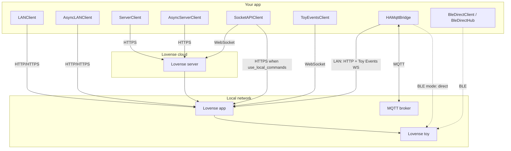

# LovensePy

[](https://opensource.org/licenses/Apache-2.0)

**LovensePy** is a Python client for the [Lovense developer APIs](https://developer.lovense.com): Standard API over LAN (Game Mode) and cloud, Socket API (WebSocket, optional LAN command path), and Toy Events. Optional pieces include a Home Assistant MQTT bridge and direct BLE control.

**Who it is for:** developers building scripts, bots, dashboards, Home Assistant integrations, or experiments. Lovense’s official docs remain the source of truth for protocol behavior; this library wraps those flows in typed, tested Python.

## Install

```bash
pip install lovensepy
```

Optional extras:

```bash
pip install 'lovensepy[service]' # HTTP service + web control panel; run: lovensepy-service
pip install 'lovensepy[mqtt]'   # Home Assistant MQTT bridge service + paho-mqtt; run: lovensepy-mqtt
pip install 'lovensepy[ble]'    # Direct BLE (bleak, pick for examples)
```

## No-code start: the web control panel

```bash
pip install 'lovensepy[service,ble]'
lovensepy-service   # opens the panel in your browser
```

The service serves a browser control panel at **`/`** (OpenAPI docs move to **`/docs`**): Bluetooth scan and one-tap connect, a slider per motor, Lovense presets, a pattern editor, running sessions with countdowns, Game Mode and Lovense cloud setup. Toys are kept connected and reconnected for you. Scan the QR code in the header to open the same panel on a phone on the same Wi-Fi — the desktop and the phone drive the same toy. For a phone that is *not* on this Wi-Fi, turn on **Phone from anywhere** in Settings (or start with `LOVENSE_TUNNEL=1`) to publish a temporary `https://*.trycloudflare.com` link via `cloudflared`. Outside visitors must enter a 6-digit code printed in the service console before the panel opens. See [Web control panel](docs/web-ui.en.md).

## Docker Compose: Mosquitto + Home Assistant

The root `docker-compose.yml` starts **Mosquitto** and **Home Assistant** only. The LovensePy MQTT bridge runs **on the host** (BLE needs Bluetooth; LAN is simpler that way too). See [compose/README.md](compose/README.md) and [Home Assistant MQTT](docs/tutorials/home-assistant-mqtt.en.md#home-assistant-with-ble-full-setup).

## Minimal example (Game Mode)

```python
from lovensepy import LANClient, Actions

client = LANClient("MyApp", "192.168.1.100", port=20011)
client.function_request({Actions.VIBRATE: 10}, time=3)
```

Enable Game Mode in Lovense Remote, use the app host’s IP, and pick the right port (e.g. **20011** for Remote, **34567** for Connect). Full setup, tutorials, and API tables are on **[GitHub Pages](https://lovensepy.koval-dev.org/)** (or browse the [docs](docs/index.en.md) folder in the repository).

For **`async`/`await`** code, **`AsyncLANClient`**, **`AsyncServerClient`**, **`BleDirectHub`**, and **`BleDirectClient`** all subclass **`LovenseAsyncControlClient`**: same control methods so you can switch transport by changing only construction. See [Connection methods](docs/connection-methods.en.md#same-control-code-different-transport) and the [API reference](docs/api-reference.en.md#lovenseasynccontrolclient).

## How clients reach the toy



## Documentation and official APIs

- **Project docs (site):** [lovensepy.koval-dev.org](https://lovensepy.koval-dev.org/) — **source:** [docs/index.en.md](docs/index.en.md) (Russian: [index.ru.md](docs/index.ru.md))
- [Lovense Standard API](https://developer.lovense.com/docs/standard-solutions/standard-api.html)
- [Lovense Socket API](https://developer.lovense.com/docs/standard-solutions/socket-api.html)
- [Toy Events API](https://developer.lovense.com/docs/standard-solutions/toy-events-api.html)

## Changelog

See [CHANGELOG.md](CHANGELOG.md).

## License

**Apache License 2.0** — see [LICENSE](LICENSE) for full text.
